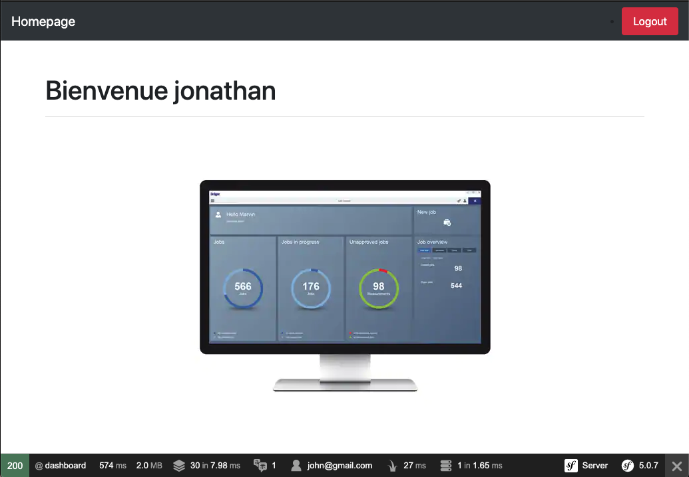

# Authentification Guard Symfony 5

### Why ?
---

### Requirements
---

- Apache 2.4
- PHP 7.3 - 7.4
- MySQL 5.7
- Composer

### Usage
---

### Installation
---

```
git clone https://github.com/jonathankablan/authentification_guard_symfony_5.git
cd authentification_guard_symfony_5/app/symfony
```

### Installation front-end
---

### Configuration database
---

```
# Créer la base de donnée si cette base n'hesite pas encore 
- bin/console d:d:c

# met a jour les entites en base de donnée
- bin/console d:s:u -f
```
### Configuration
---

### Troubleshooting
---

### FAQ
---

### Deployment
---

### Documentation
---

### Authors / Maintainers
---

- Jonathan Kablan


### Capture
---


